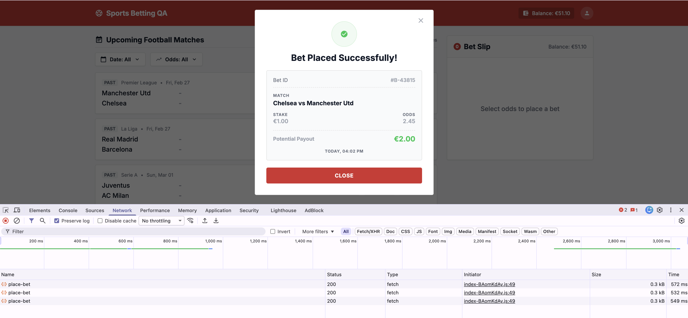
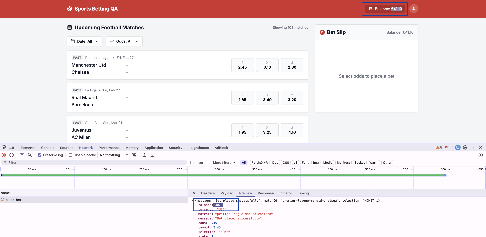
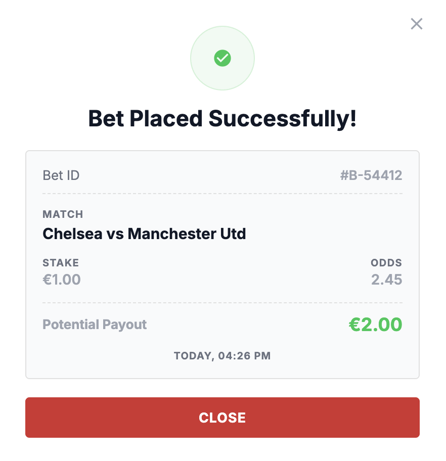

Bug ID - BugFoot1 \
Title - Multiple bets can be placed by repeatedly clicking the “Place bet” button \
Severity: High \
Reproduction Steps:
1) Open Application https://qae-assignment-tau.vercel.app/?user-id=<User-ID>
2) Find any valid record with upcoming match
3) Make a bet on any result.
4) Enter valid value in “Stake” field
5) Click on “Place bet” button
Expected: Only 1 bet should happen in network there should be only 1 successful request
Actual result: On each click on button application sending request which return 200 and decrease balance of user. 
Business Impact: Multiple successful bets can be placed if user repeatedly click on "Place bet" button, causing repeated balance deductions.
This may result in financial losses, refund requests, and loss of trust to the platform.
Evidence: 

Bug ID - BugFoot2 \
Title - Displayed user balance does not update after placing a bet \
Severity: High \
Reproduction Steps:
1) Open Application https://qae-assignment-tau.vercel.app/?user-id=<User-ID>
2) Find any valid record with upcoming match
3) Make a bet on any result.
4) Enter valid value in “Stake” field
5) Click on “Place bet” button
Expected: User balance should change according to stake 
Actual result: User balance are not changed until refresh of browser
Business Impact: The displayed balance becomes inconsistent with the actual account balance, which may confuse users,
lead to repeated betting attempts, reduce trust in the platform, and increase customer support requests.
Evidence: 

Bug ID - BugFoot3 \
Title - Successful modal does not contain information about "Selection" \
Severity: Medium \
Reproduction Steps:
1) Open Application https://qae-assignment-tau.vercel.app/?user-id=<User-ID>
2) Find any valid record with upcoming match
3) Make a bet on any result.
4) Enter valid value in “Stake” field
5) Click on “Place bet” button
Expected: User should see success modal window with next information “Bet ID”, “Match details”, “Selection”, “Stake”,
“Odds”, “Potential payouts”, “Placement timestamp”.
Actual result: In success modal information about "Selection" are absent
Business Impact: Missing selection information reduces the transparency of the bet confirmation, making it difficult 
for users to verify their placed bet
Evidence: 
